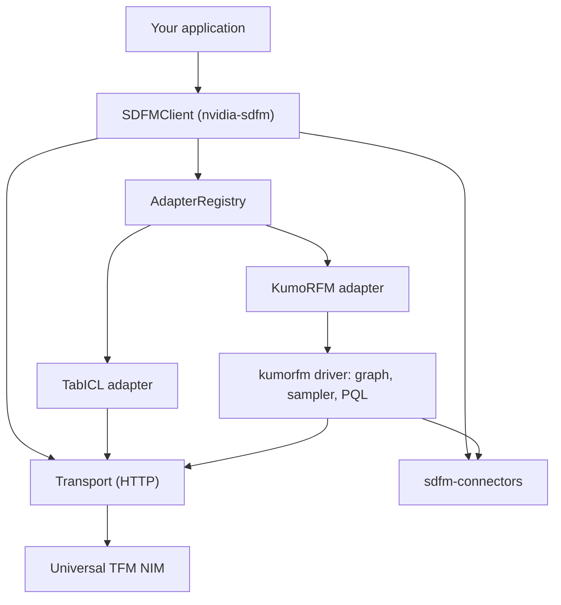

# NVIDIA SDFM SDK Architecture

The NVIDIA SDFM SDK separates a small, universal client from the heavy runtimes
that individual models need. The client is symmetric across models — every model
is a peer adapter — while a model's optional driver holds its client-side compute.

## High-Level Architecture Diagram

## Functional Layers

### Client Layer

`SDFMClient` owns one connection to a NIM. It holds a `Transport` (a pooled HTTP
session with retry and backoff) and an `AdapterRegistry`. Because each client
owns its own transport and registry, several clients can target different
endpoints or tenants in the same process without sharing global state.

### Adapter Layer

Every model is a peer module implementing the `ModelAdapter` interface and
registered in the client's `AdapterRegistry`. An adapter advertises its
capabilities, shapes an internal typed request (`TabICLRequest`, `KumoRFMRequest`,
built by the model handles) into the Universal TFM API envelope, and normalizes
the NIM's response into a consistent
pandas DataFrame. Adding a model means adding one adapter module — the client
core does not change.

### Driver Layer

A driver is a model's heavy client-side runtime, packaged as its own
distribution. The KumoRFM driver (`kumorfm`) performs graph building, native
neighbor sampling through a compiled extension, and PQL parsing. The KumoRFM
adapter lazy-imports this driver, so base installs stay lightweight and
platform-independent. TabICL requires no driver.

## Data Flow

1. Your application constructs a typed request and calls `client.predict`.
2. The client selects the model's adapter and validates the request against the
   model's advertised capabilities.
3. The adapter builds the Universal TFM API request. For KumoRFM, the driver
   parses the PQL query, samples the relevant subgraph, and materializes the
   request; for TabICL, the adapter serializes the context and predict tables
   directly.
4. The `Transport` sends the request to the NIM over HTTP with retry on
   transient failures.
5. The adapter normalizes the response into a pandas DataFrame and returns it.

## Deployment Topologies

The SDK is a client library; it connects to a NIM you deploy and operate.

- **Local NIM.** Point `SDFMClient(url=...)` at a NIM running on `localhost`.
- **Networked NIM.** Point the client at any reachable NIM endpoint. If the
  deployment fronts the NIM with an authenticating gateway, pass an `api_key`.

## Service Interactions

The client communicates with the NIM exclusively over the Universal TFM API HTTP
contract (`/v1/predictions`, plus `/v1/models` and `/v1/health/ready` for
discovery and readiness). Standard NIM management endpoints are provided by the
NIM runtime, not by the SDK.

## External Integration Points

- **Data sources.** Both the client and the KumoRFM driver read tables through
  the shared `sdfm-connectors` package (SQLite, DuckDB, Snowflake, Databricks),
  so each warehouse is reached through one place.
- **NIM endpoint.** Any NIM that implements the Universal TFM API and advertises
  a supported model in `/v1/models`.

## Related Topics

- [NVIDIA SDFM SDK Documentation](overview.md)
- [Quickstart for the NVIDIA SDFM SDK](../get-started/quickstart.md)
- [NVIDIA SDFM SDK Environment Variables](../reference/environment-variables.md)
