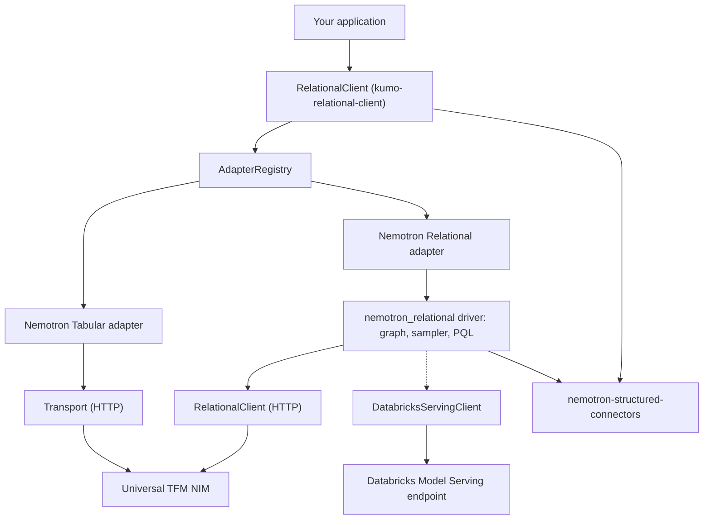

# NVIDIA Kumo Relational Client Architecture

The NVIDIA Kumo Relational Client separates a small, universal client from the heavy runtimes
that individual models need. The client is symmetric across models, since every model
is a peer adapter, while a model's optional driver holds its client-side compute.

## High-Level Architecture Diagram



## Functional Layers

### Client Layer

`RelationalClient` owns the endpoint address and an `AdapterRegistry`. Because each
client owns its own registry and configuration, several clients can target
different endpoints or tenants in the same process, concurrently: every
prediction is issued against the endpoint and credential of the client that
started it.

Requests do not all leave through the same object. The client holds a
`Transport`, a pooled HTTP session with retry and backoff, and Nemotron Tabular predicts
through it. Nemotron Relational does not: the client hands its address and credential to
the driver, which opens its own pooled session (`RelationalClient`) and sends from
there. The two are separate implementations of the same HTTP contract, because
`nemotron_relational` cannot depend on `kumo-relational-client`; the dependency runs the other way.

The Nemotron Relational driver underneath does keep a process-wide configuration, which
each prediction reconfigures. The adapter applies that configuration and
resolves the resulting client as one atomic step, then binds it to that
prediction, so a concurrent prediction from a differently configured client
cannot re-point it. What remains shared is the driver global itself: direct
`nemotron_relational.init()` callers, and anything else reading it, see whichever client
configured it last. Drive the driver through `RelationalClient` only.

### Adapter Layer

Every model is a peer module implementing the `ModelAdapter` interface and
registered in the client's `AdapterRegistry`. An adapter advertises its
capabilities, shapes an internal typed request (`KumoTabularRequest`, `KumoRelationalRequest`
built by the model handles, and not importable from `kumo_relational_client`) into the
Universal TFM API envelope, and normalizes the NIM's response into a consistent
pandas DataFrame. Adding a model means adding one adapter module, and the client
core does not change.

### Driver Layer

A driver is a model's heavy client-side runtime, packaged as its own
distribution. The Nemotron Relational driver (`nemotron_relational`) performs graph building, native
neighbor sampling through a compiled extension, and PQL parsing. The Nemotron Relational
adapter lazy-imports this driver, so base installs stay lightweight and
platform-independent. Nemotron Tabular requires no driver.

## Data Flow

1. Your application builds a model handle with `client.tabular(...)` or
   `client.relational(...)` and calls `predict` on it.
2. The handle builds that model's internal typed request; the client checks it is
   the type the model's adapter accepts and dispatches to it. Nothing is checked
   against `capabilities()`, which describes the client-side adapter for callers
   who ask and is not consulted on this path.
3. The adapter builds the Universal TFM API request. For Nemotron Relational, the driver
   parses the PQL query, samples the relevant subgraph, and materializes the
   request; for Nemotron Tabular, the adapter serializes the context and predict tables
   directly.
4. The request goes to the NIM over HTTP, with retry on transient failures:
   Nemotron Tabular sends through the client's `Transport`, Nemotron Relational through the driver's
   own `RelationalClient`. A client built with `RelationalClient.for_databricks_serving`
   sends through `DatabricksServingClient` instead, which invokes a named
   Model Serving endpoint through the Databricks SDK rather than speaking
   HTTP.
5. The adapter normalizes the response into a pandas DataFrame and returns it.

## Deployment Topologies

The client is a client library; it connects to a NIM you deploy and operate.

- **Local NIM.** Point `RelationalClient(url=...)` at a NIM running on `localhost`.
- **Networked NIM.** Point the client at any reachable NIM endpoint. If the
  deployment fronts the NIM with an authenticating gateway, pass an `api_key`.
- **Databricks Model Serving.** Build the client with
  `RelationalClient.for_databricks_serving(endpoint_name)` to reach a Nemotron Relational model
  served inside a Databricks workspace.

## Service Interactions

The client speaks the Universal TFM API. Every prediction is a
`POST /v1/predictions`, except that Nemotron Relational switches to the session routes
under `/v1/sessions` when a prediction splits into more than one batch and is
reproducible: sessions upload the context once and reuse it across the batches,
so they need a `random_seed`, and they are skipped when an explanation is
requested. Standard NIM management endpoints are provided by the NIM runtime,
not by the client.

Two endpoints are read rather than predicted against, and not by the same
caller. `RelationalClient.health_ready()` issues `GET /v1/health/ready` and reports
whether it answered 200. The Nemotron Relational driver checks more before its first
prediction: it reads `/v1/health/ready` for a ready status and then
`/v1/models`, and fails if the endpoint does not advertise
`nemotron-relational`. Nothing
on the Nemotron Tabular path reads `/v1/models`.

## External Integration Points

- **Data sources.** Both the client and the Nemotron Relational driver read tables through
  the shared `nemotron-structured-connectors` package (SQLite, DuckDB, Snowflake, Databricks),
  so each warehouse is reached through one place.
- **NIM endpoint.** Any NIM that implements the Universal TFM API. The Nemotron Relational
  path additionally requires the endpoint to advertise
  `nemotron-relational` in
  `/v1/models`.
- **Databricks Model Serving.** `RelationalClient.for_databricks_serving(name)`
  targets a named serving endpoint through the Databricks SDK. There is no base
  URL and no HTTP session on this path, and it serves Nemotron Relational only.

## Repository Layout

A monorepo workspace. Every independently released distribution lives under
`packages/` with the same `src/` and `tests/` convention:

```text
kumo-relational-client/
├── pyproject.toml              # workspace root: shared tooling only, builds nothing
├── e2e/                        # cross-distribution live harnesses
├── docs/                       # user-facing documentation
├── examples/                   # runnable notebooks and scripts
├── scripts/                    # release and maintenance tooling
└── packages/
    ├── kumo-relational-client/            # the client (pure python, universal wheel)
    │   └── src/kumo_relational_client/
    │       ├── client.py       #   RelationalClient: the entry point and its registry
    │       ├── models.py       #   the per-model handles the client hands back
    │       ├── requests.py     #   the internal typed requests handles build
    │       ├── errors.py       #   the exception hierarchy
    │       ├── core/           #   HTTP transport, response parsing, connectors, dtypes
    │       ├── base.py         #   ModelAdapter interface + AdapterRegistry
    │       ├── adapters/       #   one peer module per model
    │       │   ├── tabular.py    #   single-table (no driver)
    │       │   └── relational.py #   relational (lazy-wraps the driver)
    │       ├── wire/          #   the on-the-wire request and response shapes
    │       └── relational.py  #   explicit, lazily-resolved surface onto the driver
    ├── nemotron-structured-connectors/        # shared data-source connectors (pure python)
    │   └── src/nemotron_structured_connectors/
    └── nemotron-relational/                # the relational driver (native build)
        └── src/nemotron_relational/
```

## Adding a Model

1. Add `packages/kumo-relational-client/src/kumo_relational_client/adapters/<model>.py`
   implementing `ModelAdapter`, and register it in `_default_registry()` in
   `client.py`. The core never changes.
2. If the model needs a heavy runtime, add it under `packages/<driver>/` as its
   own distribution and add a `[<model>]` extra. The adapter lazy-imports the
   driver so base installs stay light.
3. A dependency-free model, like Nemotron Tabular, needs no driver and no extra.

## Why the Relational Adapter Is Not Symmetric With Tabular

The internal `KumoTabularRequest` (`context`, `predict`, `task`, `target`)
maps cleanly onto the wire envelope. `KumoRelationalRequest` (`graph`,
`query`, `indices`) does not. These are the shapes the handles build for the
adapters, not a user-facing API.

`NemotronRelational.predict()` takes a PQL query plus an entity graph and
builds, samples and sends the request as one fused operation. There is no
standalone "build a payload from two flat DataFrames" step to call into.
Reimplementing that outside the driver would duplicate PQL parsing, subgraph
sampling and point-in-time correctness logic that already lives, and is tested,
there.

So `adapters/relational.py` takes the shape the driver actually needs and
normalizes the result into the same DataFrame shape `core.response` produces
for Nemotron Tabular. Callers get one consistent return type either way.

## Sessions

A session pins `model`, `task`, `schema` and `context` on the NIM so later
calls send only the rows to score. Both model paths use them and neither
exposes them: they are a transport optimisation and never change a prediction.

- **Nemotron Tabular.** `client.tabular(context, ...)` reuses one session for
  the life of the handle. It opens on the second `predict()` against the same
  context, so scoring a single table costs exactly one request as before, and
  every call after that carries the rows alone.
- **Nemotron Relational.** A multi-batch `predict()` opens one session for the
  run and deletes it at the end. Set `KUMO_RELATIONAL_DISABLE_SESSIONS=1` to
  force the stateless path.

Both fall back to `POST /v1/predictions` when the NIM answers 404, 405 or 501
on session creation, and both re-pin the context transparently if a session
expires.

## Related Topics

- [NVIDIA Kumo Relational Client Documentation](overview.md)
- [Quickstart for the NVIDIA Kumo Relational Client](../get-started/quickstart.md)
- [NVIDIA Kumo Relational Client Environment Variables](../reference/environment-variables.md)
