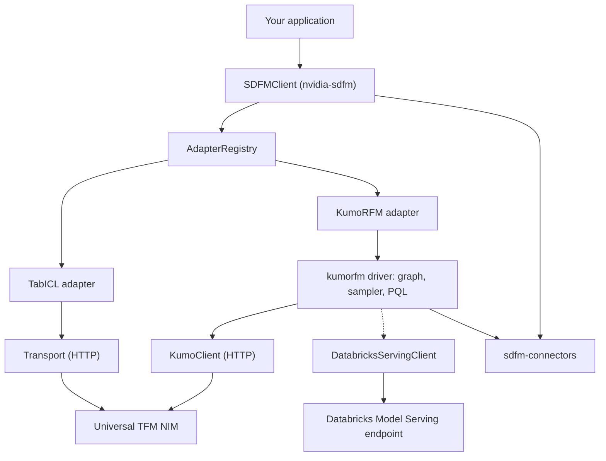

# NVIDIA SDFM SDK Architecture

The NVIDIA SDFM SDK separates a small, universal client from the heavy runtimes
that individual models need. The client is symmetric across models — every model
is a peer adapter — while a model's optional driver holds its client-side compute.

## High-Level Architecture Diagram

## Functional Layers

### Client Layer

`SDFMClient` owns the endpoint address and an `AdapterRegistry`. Because each
client owns its own registry and configuration, several clients can target
different endpoints or tenants in the same process, concurrently: every
prediction is issued against the endpoint and credential of the client that
started it.

Requests do not all leave through the same object. The client holds a
`Transport`, a pooled HTTP session with retry and backoff, and TabICL predicts
through it. KumoRFM does not: the client hands its address and credential to
the driver, which opens its own pooled session (`KumoClient`) and sends from
there. The two are separate implementations of the same HTTP contract, because
`kumorfm` cannot depend on `nvidia-sdfm` — the dependency runs the other way.

The KumoRFM driver underneath does keep a process-wide configuration, which
each prediction reconfigures. The adapter applies that configuration and
resolves the resulting client as one atomic step, then binds it to that
prediction, so a concurrent prediction from a differently configured client
cannot re-point it. What remains shared is the driver global itself: direct
`kumorfm.init()` callers, and anything else reading it, see whichever client
configured it last. Drive the driver through `SDFMClient` only.

### Adapter Layer

Every model is a peer module implementing the `ModelAdapter` interface and
registered in the client's `AdapterRegistry`. An adapter advertises its
capabilities, shapes an internal typed request (`TabICLRequest`, `KumoRFMRequest`
— built by the model handles, and not importable from `nvidia_sdfm`) into the
Universal TFM API envelope, and normalizes the NIM's response into a consistent
pandas DataFrame. Adding a model means adding one adapter module — the client
core does not change.

### Driver Layer

A driver is a model's heavy client-side runtime, packaged as its own
distribution. The KumoRFM driver (`kumorfm`) performs graph building, native
neighbor sampling through a compiled extension, and PQL parsing. The KumoRFM
adapter lazy-imports this driver, so base installs stay lightweight and
platform-independent. TabICL requires no driver.

## Data Flow

1. Your application builds a model handle with `client.tabicl(...)` or
   `client.kumorfm(...)` and calls `predict` on it.
2. The handle builds that model's internal typed request; the client checks it is
   the type the model's adapter accepts and dispatches to it. Nothing is checked
   against `capabilities()`, which describes the client-side adapter for callers
   who ask and is not consulted on this path.
3. The adapter builds the Universal TFM API request. For KumoRFM, the driver
   parses the PQL query, samples the relevant subgraph, and materializes the
   request; for TabICL, the adapter serializes the context and predict tables
   directly.
4. The request goes to the NIM over HTTP, with retry on transient failures:
   TabICL sends through the client's `Transport`, KumoRFM through the driver's
   own `KumoClient`. A client built with `SDFMClient.for_databricks_serving`
   sends through `DatabricksServingClient` instead, which invokes a named
   Model Serving endpoint through the Databricks SDK rather than speaking
   HTTP.
5. The adapter normalizes the response into a pandas DataFrame and returns it.

## Deployment Topologies

The SDK is a client library; it connects to a NIM you deploy and operate.

- **Local NIM.** Point `SDFMClient(url=...)` at a NIM running on `localhost`.
- **Networked NIM.** Point the client at any reachable NIM endpoint. If the
  deployment fronts the NIM with an authenticating gateway, pass an `api_key`.
- **Databricks Model Serving.** Build the client with
  `SDFMClient.for_databricks_serving(endpoint_name)` to reach a KumoRFM model
  served inside a Databricks workspace.

## Service Interactions

The SDK speaks the Universal TFM API. Every prediction is a
`POST /v1/predictions`, except that KumoRFM switches to the session routes
under `/v1/sessions` when a prediction splits into more than one batch and is
reproducible: sessions upload the context once and reuse it across the batches,
so they need a `random_seed`, and they are skipped when an explanation is
requested. Standard NIM management endpoints are provided by the NIM runtime,
not by the SDK.

Two endpoints are read rather than predicted against, and not by the same
caller. `SDFMClient.health_ready()` issues `GET /v1/health/ready` and reports
whether it answered 200. The KumoRFM driver checks more before its first
prediction: it reads `/v1/health/ready` for a ready status and then
`/v1/models`, and fails if the endpoint does not advertise `kumo-rfm`. Nothing
on the TabICL path reads `/v1/models`.

## External Integration Points

- **Data sources.** Both the client and the KumoRFM driver read tables through
  the shared `sdfm-connectors` package (SQLite, DuckDB, Snowflake, Databricks),
  so each warehouse is reached through one place.
- **NIM endpoint.** Any NIM that implements the Universal TFM API. The KumoRFM
  path additionally requires the endpoint to advertise `kumo-rfm` in
  `/v1/models`.
- **Databricks Model Serving.** `SDFMClient.for_databricks_serving(name)`
  targets a named serving endpoint through the Databricks SDK. There is no base
  URL and no HTTP session on this path, and it serves KumoRFM only.

## Related Topics

- [NVIDIA SDFM SDK Documentation](overview.md)
- [Quickstart for the NVIDIA SDFM SDK](../get-started/quickstart.md)
- [NVIDIA SDFM SDK Environment Variables](../reference/environment-variables.md)
